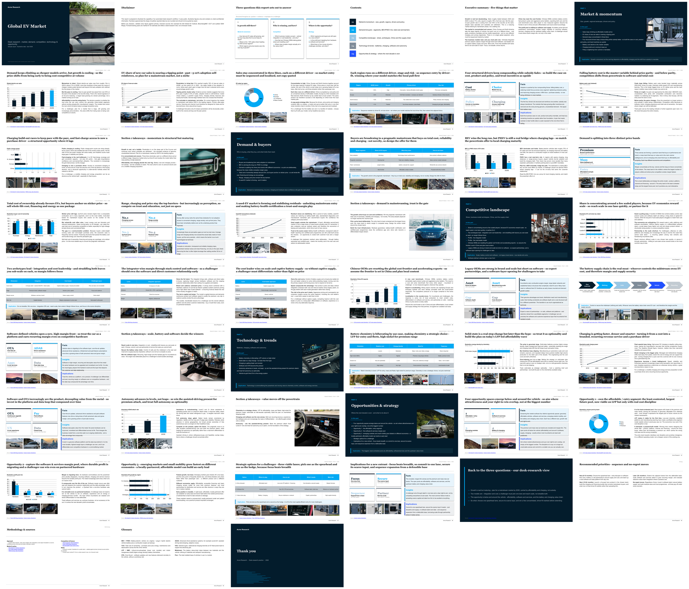
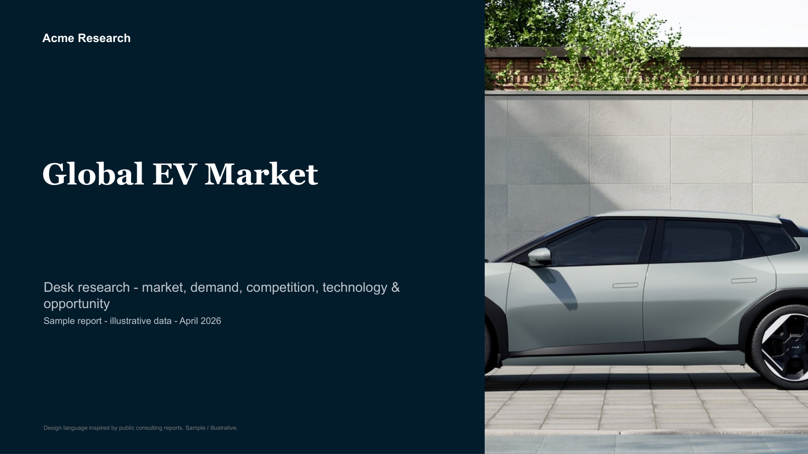
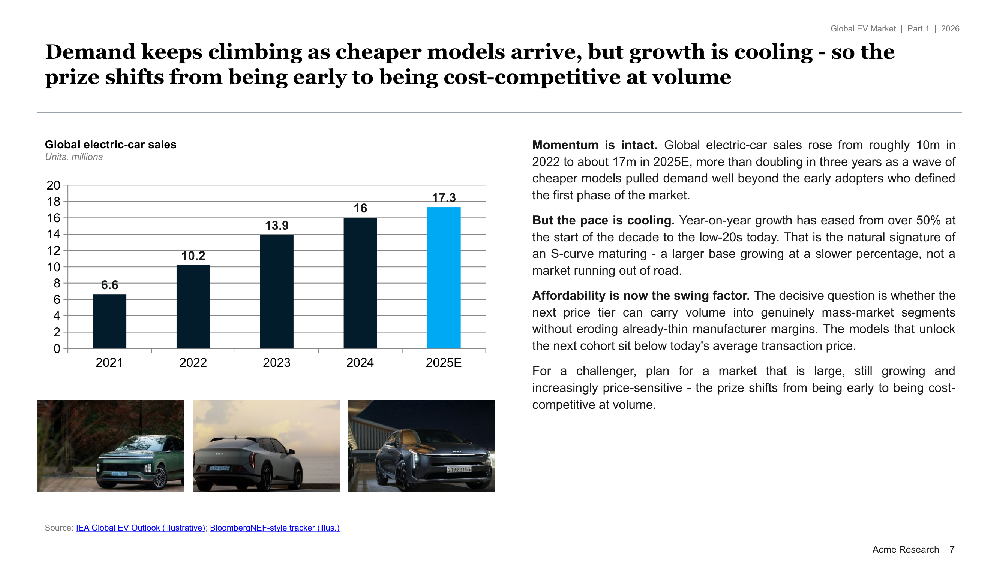
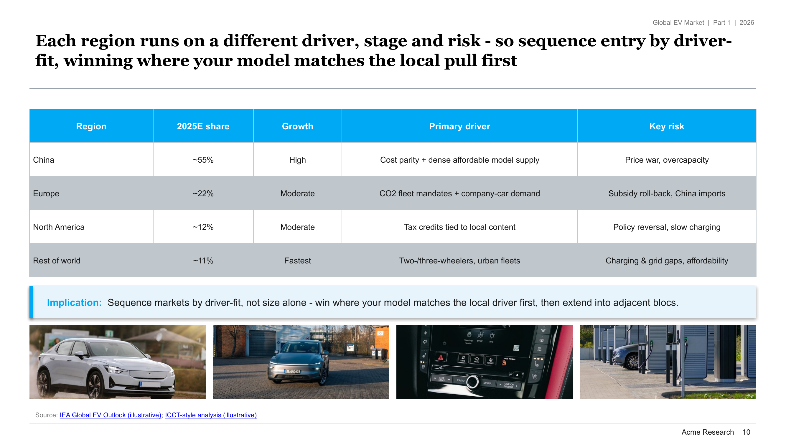
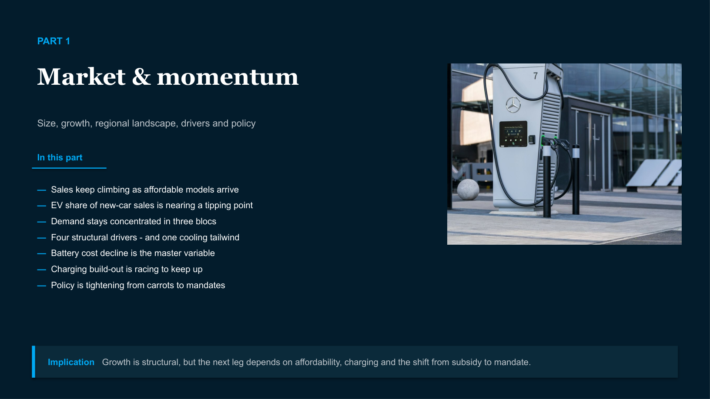
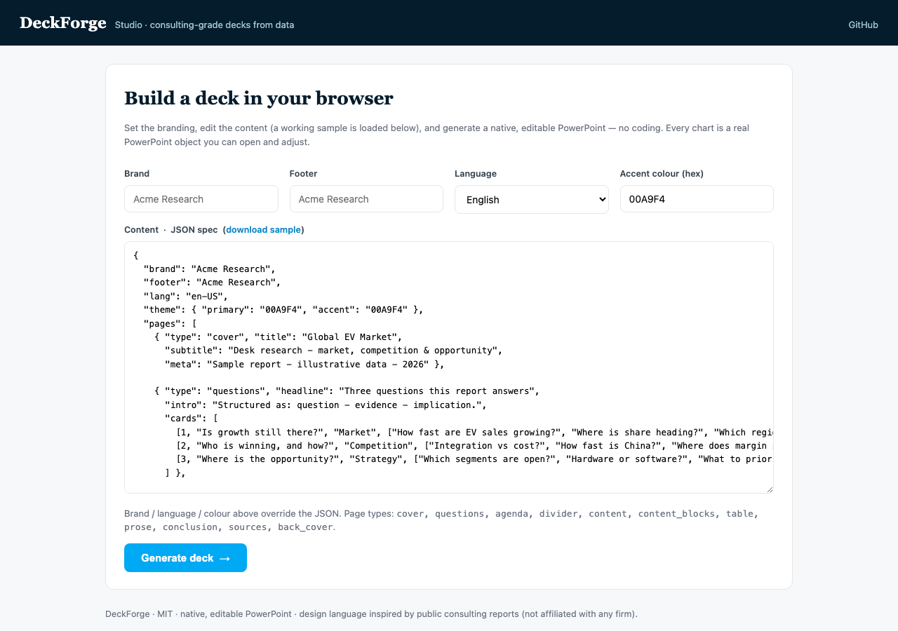

<div align="center">

# 📊 DeckForge

**Consulting-grade desk-research decks — generated from data, in Python.**

[](LICENSE)
&nbsp;[](https://www.python.org/)
&nbsp;[](https://python-pptx.readthedocs.io/)

**English** · [中文](README.zh-CN.md)



</div>

---

DeckForge turns structured research into a clean, **McKinsey-style** market-research
deck — entirely with [`python-pptx`](https://python-pptx.readthedocs.io/). No
template files, no proprietary fonts, no manual slide-pushing. Every chart is a
**native, editable PowerPoint object** (not a screenshot), every page follows a
consulting skeleton, and the whole look re-brands from a single `Theme`. It ships
with a complete, runnable **51-slide example** in **English and Chinese**.

---

## 💡 Why it matters

A market-entry or strategy decision usually starts with a **desk-research deck** —
50+ pages that size the market, map the competition, and spell out the
implications. Producing one to a top-tier-consulting standard is **slow and
manual**: analysts hand-build every chart, retype the same numbers, and fight
PowerPoint formatting for days, and the result still drifts off-brand.

**DeckForge makes that pass programmatic, reproducible and on-brand.** Feed it
structured data; get back a complete, formal, client-grade deck — native editable
charts, a consistent visual system, a MECE section structure, and sources on every
page. Re-run it when the data changes; re-skin the whole thing by swapping one
`Theme`.

---

## 📸 See it

The bundled example — a **51-slide deck on the (public, illustrative) global EV
market** — exercises every page type.

| Navy cover + serif title | Title + native chart + analysis |
|:---:|:---:|
|  |  |
| **Comparison table + takeaway** | **Facts / Insights / Implications** |
|  |  |

---

## 🎯 What this project demonstrates

- **Automating a real, high-effort deliverable.** A consulting desk-research deck
  is days of manual work. I turned it into a data-driven, reproducible build that
  outputs a complete 50+ page, client-grade report.

- **Design-system fidelity.** The look faithfully reconstructs a top-tier
  consulting visual identity — deep-navy + white high contrast, **serif headlines**,
  hairline rules, a signature line motif — from a single, swappable `Theme`. Chinese
  text uses **KaiTi (楷体)**, as McKinsey China does.

- **Native, not faked.** Charts and tables are real, editable PowerPoint objects
  the client can open and adjust — never matplotlib screenshots. One accent color
  highlights *the single most important datapoint* per chart.

- **Engineering that re-uses cleanly.** Builds on a blank presentation (no template
  dependency), runs anywhere, is fully internationalised (EN / 中文 via a `labels`
  dict), and re-brands in one place.

- **Judgment & integrity.** This public version is fully **desensitized** — generic,
  McKinsey-inspired design and round/illustrative data only, with **zero** client
  names, real data, proprietary fonts or trademarks. I can build in the open *and*
  protect confidential material.

---

## 🧭 How it works

Every content page is one atomic unit: an **action-title conclusion** (a full
cause → effect sentence) + a **native visual** (chart / table / framework) +
**analysis** (flowing body or Facts / Insights / Implications blocks) + cited
sources. Pages assemble into a consulting skeleton:

```
Cover → Three core questions → Contents → Executive summary
      → Section (divider + mini-TOC → dense content pages → takeaways) × N
      → Conclusion (answers the opening questions) → Methodology → Appendix
```

Two non-negotiables baked into the methodology: decks are **50+ pages** and
**MECE** — sections are *Mutually Exclusive and Collectively Exhaustive*, covering
the whole topic with no gaps or overlap. Full write-up in
[docs/methodology.md](docs/methodology.md); the design system (palette, typography,
re-branding) is in [docs/design-system.md](docs/design-system.md).

---

## 🧠 Use it as a Claude Skill

DeckForge ships a [**Claude Skill**](skill/) that adds what a rendering library can't give
you on its own: the **hypothesis-driven analysis front-end** (Is/Isn't boundary → Issue
Tree, MECE → Hypothesis Tree → **Dummy Pages**: lay out a 50+ page empty skeleton before
gathering data) and an **iterative QC** layer (5 rounds + 6 layout-defect classes). It wires
those — absorbed from McKinsey Problem Solving — to this engine, so Claude can run the whole
pipeline from one sentence.

```bash
ln -s "$(pwd)/skill" ~/.claude/skills/deckforge-desk-research   # install
# then, in any conversation:  "Use the desk-research skill to build a deck on <topic>."
```

`skill/SKILL.md` is the navigation map; `skill/references/` (workflow, QC, build guide) load
on demand. Details in [skill/README.md](skill/README.md).

---

## 🚀 Try it in 30 seconds

```bash
pip install -r requirements.txt

python app.py                                # ⭐ web app -> http://127.0.0.1:5000 (no coding)
python examples/ev_market/build_deck.py      # English  -> output/ev_market.pptx     (51 slides)
python examples/ev_market/build_deck_zh.py   # 中文     -> output/ev_market_zh.pptx  (51 slides)
```

### 🖥 No code? Use the web app

`python app.py` launches **DeckForge Studio** — fill in the branding, edit a
content spec (a working sample is pre-loaded), pick a language, and download a
native, editable `.pptx`. Anyone can build a deck in the browser.



```python
from deckforge import Deck, charts

deck = Deck(brand="Acme Research", footer="Acme Research")
deck.cover("Global EV Market", subtitle="Desk research", meta="2026")

slide, (x, y, w, h) = deck.content(
    "Demand keeps climbing as cheaper models arrive, but growth is cooling",
    body=[("Momentum is intact.", "Sales rose from ~10m (2022) to ~17m (2025E)."),
          "The open question is whether affordability carries volume to mass market."],
    sources=[("IEA", "https://www.iea.org")],
)
charts.column(slide, deck.theme, x, y + 0.55, w, h - 0.6,
              ["2022", "2023", "2025E"], {"Units (m)": [10, 14, 17]}, highlight=(0, 2))
deck.save("ev_market.pptx")
```

---

## 🔧 Under the hood

```
deckforge/            # the toolkit
  theme.py            #   design system (palette / typography) — swap to re-brand
  text.py             #   serif/sans fonts + CJK glyphs + rich emphasis
  core.py             #   Deck: cover, dividers, content, tables, conclusion …
  charts.py           #   native column / bar / line / doughnut (one-point highlight)
  tables.py           #   themed comparison tables + takeaway bar
  components.py       #   Facts / Insights / Implications insight blocks
  frameworks.py       #   KPI / 2×2 maps, value-chain chevrons, image rows
  images.py           #   download → validate → perceptual-hash dedup → aspect-fit
examples/ev_market/   # runnable EN + 中文 51-page demo
docs/                 # methodology.md · design-system.md
assets/               # screenshots + (permissively-licensed) demo imagery
```

- **Native charts**, editable in PowerPoint — never screenshots.
- **One `Theme`** re-brands the entire deck (palette, fonts, sizes).
- **Bilingual / i18n-ready** — UI strings switch via a `labels` dict; CJK uses KaiTi.
- ~**2.2 photos per page** from permissively-licensed imagery (see
  [assets/images/CREDITS.md](assets/images/CREDITS.md)).

---

## ⚖️ Attribution & scope

Design language is **inspired by** publicly available consulting reports. This
project is **not affiliated with or endorsed by** McKinsey & Company or any firm,
and bundles **no proprietary fonts, templates or trademarks** (Georgia / Arial /
KaiTi are generic substitutes). All example data is round / illustrative. MIT
licensed — see [LICENSE](LICENSE).

---

## 👤 About the author

**Xiangyu (Frank) Bai** — a market researcher / analyst who builds AI-assisted
tools to solve real business problems. DeckForge is the open, desensitized
distillation of a real desk-research production pipeline.

Open to opportunities in **market research, data analysis, and consulting**.

- **LinkedIn:** https://www.linkedin.com/in/frank-bai-411173260
- **GitHub:** https://github.com/frankglendon
